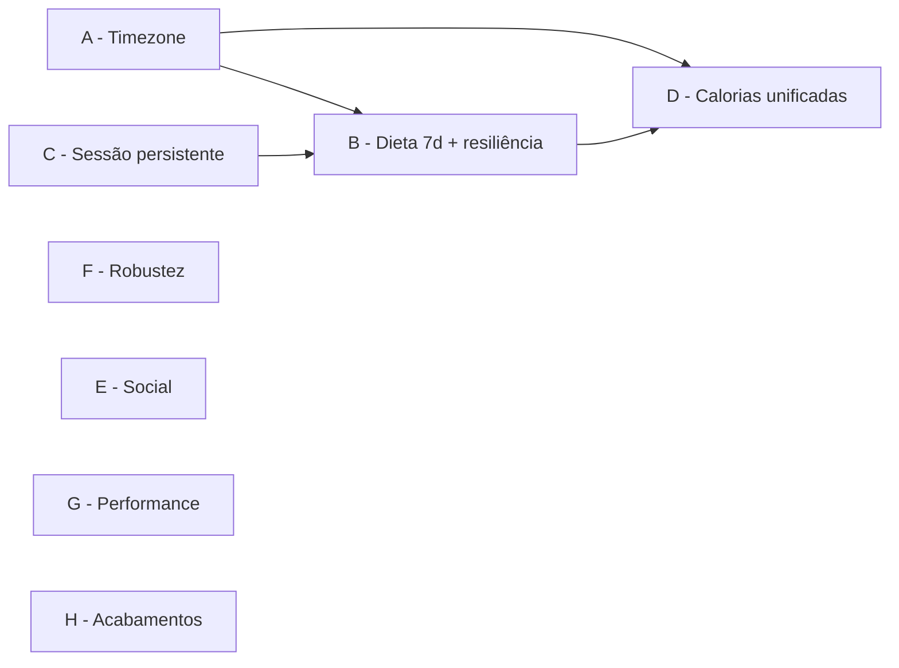

# Spec — Correções da Auditoria CalorIA

**Data:** 2026-07-24
**Origem:** Auditoria completa de gaps de lógica, gargalos e usabilidade (backend Fastify/Supabase + app React Native).
**Status:** Aprovada para planejamento (decisões de produto fechadas com o dono do projeto).

---

## 1. Objetivo

Corrigir os 28 achados da auditoria, agrupados em 8 workstreams (A–H) que podem ser planejados e entregues de forma independente. Cada workstream produz software funcional e testável sozinho.

## 2. Decisões de produto (fechadas)

| # | Decisão | Escolha |
|---|---------|---------|
| D1 | Dieta no fim de semana | **Gerar 7 dias** (job passa de 5 → 7 chamadas de IA) |
| D2 | Estratégia de timezone | **Data local do cliente é a fonte de verdade** (enviada em cada request relevante) |
| D3 | Anel de calorias | **Plano concluído + diário livre somam juntos** |
| D4 | UI de amigos | **Incluída nesta spec** (backend já existe) |

## 3. Convenções globais

Valem para todos os workstreams:

- **Formato de data local:** string `YYYY-MM-DD`, produzida no app por `todayString()` / `dateToString()` de [app/src/shared/utils/date.ts](../../../app/src/shared/utils/date.ts) (já são locais — não usar `toISOString()`).
- **Validação de data no backend:** toda data recebida do cliente deve ser Zod `z.string().regex(/^\d{4}-\d{2}-\d{2}$/)` + janela de sanidade: entre `hoje UTC − 30 dias` e `hoje UTC + 1 dia`. Fora da janela → `400 INVALID_DATE`.
- **`dayNumber` local:** inteiro 1–7 (1=Segunda … 7=Domingo), calculado no app como `((new Date().getDay() + 6) % 7) + 1`.
- **Retrocompatibilidade:** parâmetros novos de data/dia são **opcionais** nos endpoints; na ausência, o backend mantém o comportamento UTC atual (permite deploy de backend antes do app).
- **Erros:** manter o padrão `AppError(status, CODE, mensagem-pt)` existente.
- **Testes:** backend com Vitest (padrão existente `*.test.ts` ao lado do módulo); lógica pura extraída para funções exportadas testáveis (padrão já usado em `feed.service.test.ts`).
- **Migrations:** arquivos novos numerados a partir de `014_` em `backend/supabase/migrations/` (nota: existem dois `012_*.sql` — não renumerar os antigos).
- **Nenhuma dependência nova** além de `@react-native-async-storage/async-storage` (Workstream C).

---

## Workstream A — Timezone: data local do cliente

**Achados:** #2 (4 pontos UTC), view `active_diet_today` com `EXTRACT(DOW FROM NOW())`.

**Problema:** servidor roda em UTC; a partir das 21h BRT o app "vira o dia": dieta mostra o dia seguinte, refeição registrada some da lista, check-in de desafio cai no dia errado e quebra streak.

### Design

O cliente informa sua data/dia local; o servidor não deriva mais "hoje" do relógio próprio em nenhuma rota de negócio.

### Requisitos

- **A1.** `GET /diets/today` e `GET /diets/today-plan` (rota do dashboard) aceitam query `dayNumber` (1–7, opcional). Presente → usa-o no lugar de `((new Date().getDay() + 6) % 7) + 1` em [diets.service.ts:247](../../../backend/src/modules/diets/diets.service.ts#L247) e [:301](../../../backend/src/modules/diets/diets.service.ts#L301). Aceitam também `date` (`YYYY-MM-DD`, opcional) que substitui `new Date().toISOString().slice(0,10)` no campo `date` do `TodayPlan` e serve de referência para A5.
- **A2.** `POST /food-log` aceita `date` no body (opcional, validação da convenção global). Presente → `INSERT ... meal_date = ${date}` em vez de `CURRENT_DATE` ([food-log.service.ts:56](../../../backend/src/modules/food-log/food-log.service.ts#L56)). Isso também habilita registro retroativo (achado #24 parcial).
- **A3.** `POST /challenges/:id/checkin` aceita `date` no body (opcional). Presente → substitui `new Date().toISOString().slice(0,10)` em [challenges.service.ts:223](../../../backend/src/modules/challenges/challenges.service.ts#L223). A comparação de streak (`last_check_in = date − 1 day`) usa a mesma data.
- **A4.** Migration `014`: `update_user_streak(p_user_id UUID, p_date DATE DEFAULT CURRENT_DATE)` — nova assinatura com data explícita (a antiga de 1 argumento continua funcionando via DEFAULT). Chamadas em [diets.service.ts:149,393](../../../backend/src/modules/diets/diets.service.ts#L393) passam a data local recebida do cliente (quando presente).
- **A5.** "Refeição concluída" passa a ser **derivada de `completed_at`**, não do booleano: uma refeição do plano conta como concluída no dia `date` se `completed_at` (convertido com o offset do cliente) cai em `date`. Implementação: `GET /diets/today*` aceita `tzOffsetMinutes` (inteiro, −840…+720, opcional; ex.: BRT = −180) e retorna cada meal com campo novo `completedToday: boolean` calculado por `(completed_at + tzOffsetMinutes)::date = date`. O campo `completedAt` cru continua na resposta. *(Este requisito é a metade timezone do reset semanal — o comportamento completo está em B3.)*
- **A6.** App: todos os pontos de chamada enviam os novos parâmetros — `dietService.getToday()` ([diet.service.ts](../../../app/src/shared/services/diet.service.ts)) envia `dayNumber`, `date`, `tzOffsetMinutes`; `foodLogService.addMeal` envia `date: todayString()` (ou a `selectedDate` do diário); `challengesService.checkIn` envia `date: todayString()`.
- **A7.** Migration `014`: recriar a view `active_diet_today` sem `EXTRACT(DOW FROM NOW())` **ou** removê-la se nenhum consumidor existir (verificar PostgREST; o backend não a usa). Documentar a escolha na migration.
- **A8.** `challenges.checkIn` mantém validação de sanidade: `date` deve estar entre hoje UTC −1 e hoje UTC +1 (check-in não é retroativo).

### Critérios de aceite

1. Simulando relógio do servidor em `2026-07-26T01:00:00Z` (sábado 22h BRT de sexta), `GET /diets/today?dayNumber=5` retorna o dia 5 (Sexta) — não o 6.
2. `POST /food-log` com `date=2026-07-25` às 01h UTC do dia 26 grava `meal_date=2026-07-25` e a refeição aparece em `GET /food-log?date=2026-07-25`.
3. Check-in com `date` local às 22h BRT + novo check-in na manhã seguinte (data local +1) → streak incrementa; nenhum `ALREADY_CHECKED_IN` indevido.
4. Testes unitários das funções de data (backend) e dos services do app cobrindo a fronteira 21h–00h BRT.

---

## Workstream B — Dieta: 7 dias, conclusão por dia e geração resiliente

**Achados:** #3 (fim de semana), #4 (is_completed nunca reseta), #5 (dieta antiga destruída antes da nova existir; falha terminal sem retry), #22 (steps concorrentes duplicam chamada de IA).

### Design

- Dieta passa a ter 7 dias (D1).
- "Concluída" é sempre relativa ao dia local corrente (deriva de `completed_at` — ver A5). O booleano `is_completed` fica **deprecado para leitura** (mantido no schema, ignorado pelo app).
- Dieta nova nasce como rascunho; a troca `active → replaced` só acontece na conclusão do último dia, em transação.
- Job com falha é retomável.

### Requisitos

- **B1.** `TOTAL_DAYS = 7` em [jobs.service.ts:14](../../../backend/src/modules/diets/jobs.service.ts#L14). O prompt de cada dia já recebe `dayNumber` e `DAYS_PT` tem os 7 nomes — sem outra mudança de prompt. O default `total_days` da tabela `diet_jobs` já é 7 (nenhuma migration).
- **B2.** Migration `014`: `ALTER TABLE diets DROP CONSTRAINT diets_status_check` e recriar `CHECK (status IN ('active','archived','replaced','draft','failed'))`.
- **B3.** `createDietJob` ([jobs.service.ts:76-113](../../../backend/src/modules/diets/jobs.service.ts#L76)) **não** arquiva mais a dieta ativa e insere a nova com `status='draft'`. `processJobStep`, ao concluir o último dia, executa em transação: `UPDATE diets SET status='replaced' WHERE user_id AND status='active'` + `UPDATE diets SET status='active' WHERE id = job.diet_id`. Se o job falhar definitivamente (B5 esgotado), a dieta draft vira `status='failed'` — a dieta ativa anterior permanece intocada.
- **B4.** `getActiveDiet`/`getTodayPlan` não retornam drafts (já filtram `status='active'` — apenas garantir por teste).
- **B5.** Nova rota `POST /diets/jobs/:id/retry`: permitida se `status='failed'` e dono do job; efeito: `UPDATE diet_jobs SET status='running', error=NULL` (mantém `days_completed` — retoma de onde parou) e a dieta associada volta de `failed` para `draft`. Resposta: `JobStatus`. O `/step` seguinte continua a geração normalmente.
- **B6.** Nova rota `GET /diets/jobs/active`: retorna o job mais recente do usuário com `status IN ('pending','running')` (ou `404 NO_ACTIVE_JOB`). Usada pelo app no boot para retomar polling de geração interrompida (integra com C4).
- **B7.** App — conclusão por dia: `PlannedMeal` ganha `completedToday: boolean` (vindo de A5). [diet/store.ts](../../../app/src/features/diet/store.ts), [DashboardScreen.tsx:76](../../../app/src/features/dashboard/screens/DashboardScreen.tsx#L76) e componentes de dieta trocam toda leitura `completedAt !== null` por `completedToday`. O toggle otimista atualiza `completedToday` e mantém `completedAt` para rollback.
- **B8.** App — retry visível: quando `dietJob.status === 'failed'`, o CoachScreen mostra botão "Tentar novamente" que chama `POST /diets/jobs/:id/retry` e reinicia `runDietGeneration(jobId)` ([coach/store.ts:150](../../../app/src/features/coach/store.ts#L150)). O `jobId` do job em andamento passa a ficar no estado persistido (C3).
- **B9.** Steps sem concorrência: em `runDietGeneration`, após um catch (timeout/rede), o loop **só** consulta `getJob` até obter resposta conclusiva; um novo `/step` é disparado apenas quando o último `/step` retornou (sucesso ou erro definitivo do servidor). Implementação: flag `stepInFlight` no escopo do loop; o caminho de recuperação usa exclusivamente `getJob` + `sleep` até `daysCompleted` avançar ou 4 misses.
- **B10.** `toggleMealCompleted` ([diets.service.ts:367](../../../backend/src/modules/diets/diets.service.ts#L367)) vira uma única query atômica: `UPDATE diet_meals SET is_completed = NOT is_completed, completed_at = CASE WHEN is_completed THEN NULL ELSE NOW() END ... RETURNING is_completed` (com o mesmo join de ownership), eliminando a race select-then-update.

### Critérios de aceite

1. Job novo gera 7 dias; sábado/domingo retornam plano normal (`dayNumber=6/7`).
2. Matar a geração no dia 3 e chamar `/retry` → conclui os dias 4–7 sem regenerar 1–3; dieta anterior continua `active` durante todo o processo e só vira `replaced` no fim.
3. Refeição marcada na segunda-feira aparece **desmarcada** na segunda seguinte (mesma linha `diet_meals`, `completedToday=false`), sem nenhum job de reset.
4. Teste do store do coach: simular timeout de step → nenhum segundo `/step` é emitido enquanto o primeiro não retornou.

---

## Workstream C — Sessão persistente, retomada e recuperação de senha

**Achados:** #6 (sessão/conversa não sobrevivem a restart), #14 (logout indevido offline), #13 (ForgotPassword é stub).

### Design

Persistência local com `@react-native-async-storage/async-storage` + middleware `persist` do zustand (no web o adapter cai em `localStorage`). Hidratação antes de decidir a navegação.

### Requisitos

- **C1.** Adicionar dependência `@react-native-async-storage/async-storage` (app). Criar `app/src/shared/services/storage.ts` exportando um storage compatível com zustand `persist` (AsyncStorage nativo / localStorage web).
- **C2.** [auth/store.ts](../../../app/src/features/auth/store.ts) usa `persist` com `partialize` para `{ token, refreshToken, user, isAuthenticated }` (chave `caloria:auth`). `profilePreferences` continua no mecanismo atual.
- **C3.** [coach/store.ts](../../../app/src/features/coach/store.ts) persiste `{ conversationId, activeJobId }` (chave `caloria:coach`). `messages` **não** são persistidos — ao abrir o Coach com `conversationId` e `messages` vazio, `loadHistory()` busca do backend (endpoint já existe).
- **C4.** Boot ([App.tsx](../../../app/App.tsx) / RootNavigator): aguardar `onRehydrateStorage` do auth store (splash simples enquanto hidrata). Se autenticado: (a) disparar `GET /diets/jobs/active`; se houver job, chamar `runDietGeneration(jobId)` — retomada automática de geração interrompida (usa B6).
- **C5.** [api.ts](../../../app/src/shared/services/api.ts): `clearToken()` só quando a falha é de **autenticação**: refresh respondeu HTTP 4xx. Se o refresh falhou sem `response` (rede/timeout), rejeitar o request original **sem** deslogar. Cobrir com teste (axios mock: refresh com `ECONNABORTED` → estado auth intacto).
- **C6.** Recuperação de senha — backend: `POST /auth/forgot-password` body `{ email }`, rate limit 5/min, chama `supabaseAuth.auth.resetPasswordForEmail(email, { redirectTo: <WEB_URL>/reset-password })`; resposta sempre `200 { success: true }` (não revelar existência do email). `POST /auth/reset-password` body `{ access_token, new_password }` → `supabase.auth.admin.updateUserById` após validar o token de recovery (via `supabaseAuth.auth.getUser(access_token)`).
- **C7.** Recuperação de senha — app: [ForgotPasswordScreen.tsx](../../../app/src/features/auth/screens/ForgotPasswordScreen.tsx) ganha formulário de email → chama C6 → estado de sucesso ("enviamos um link"). Nova rota web `/reset-password` (tela `ResetPasswordScreen` no AuthStack + entrada no `linking`) que lê o token do fragment da URL do Supabase e envia a nova senha.

### Critérios de aceite

1. Login → matar o app → reabrir: usuário continua logado, dashboard carrega sem tela de login.
2. Conversa com o coach → matar o app → reabrir Coach: histórico completo reaparece (vindo do backend).
3. Geração de dieta interrompida no meio → reabrir app: barra de progresso retoma sozinha e a dieta conclui.
4. Modo avião durante uso → request falha → usuário **não** é deslogado; voltando a conexão, próximo request funciona.
5. Fluxo completo de reset de senha funciona no deploy web (email chega, link abre `/reset-password`, senha troca, login com a nova senha).

---

## Workstream D — Contagem de calorias unificada + scanner confiável

**Achados:** #7 (anel ignora diário livre quando há plano), #11 (confirm parcial duplica; cache stale), #25 (tipo de refeição fixo `other`).

### Requisitos

- **D1.** [DashboardScreen.tsx:76-97](../../../app/src/features/dashboard/screens/DashboardScreen.tsx#L76): `totals` = soma de (refeições do plano com `completedToday`) **+** (todas as `foodLogMeals` do dia). Remover o modo exclusivo `useDietForTotals`. As metas continuam vindo do plano quando existe (senão defaults atuais).
- **D2.** Scanner confirm sem duplicação: em [scanner/store.ts:58-75](../../../app/src/features/scanner/store.ts#L58), trocar `Promise.all` por `Promise.allSettled`; itens salvos com sucesso são **removidos** de `items` imediatamente; em caso de falha parcial, o alerta lista apenas os restantes e o retry reenvia só esses.
- **D3.** Scanner atualiza o diário: cada `addMeal` bem-sucedido do confirm também chama `useFoodLogStore.getState().addMeal(todayString(), meal)` — dashboard e diário refletem na hora, sem refetch.
- **D4.** `POST /food-log` aceita `mealType` opcional (`'breakfast'|'lunch'|'snack'|'dinner'|'other'`, default `'other'`) e o grava em `meals.meal_type` ([food-log.service.ts:56](../../../backend/src/modules/food-log/food-log.service.ts#L56)). O `AddMealModal` ganha seletor de tipo (4 chips + "Outro"); a listagem do diário agrupa por `mealType` quando disponível, caindo para o heurístico por horário (`getMealGroup`) nos registros antigos.
- **D5.** Validação numérica no `AddMealModal` ([AddMealModal.tsx:33-45](../../../app/src/features/food-log/components/AddMealModal.tsx#L33)): rejeitar `NaN`/negativos antes do submit (botão desabilitado + mensagem inline); backend já valida por Zod (conferir limites: calories 0–10000, macros 0–1000).

### Critérios de aceite

1. Com dieta ativa: marcar 1 refeição do plano (500 kcal) + escanear 1 prato (300 kcal) → anel mostra 800 kcal na hora, sem reload.
2. Confirm do scanner com 3 itens onde o 2º falha → 1º e 3º salvos uma única vez; retry salva apenas o 2º.
3. Refeição adicionada como "Almoço" às 23h aparece agrupada em Almoço (não em Jantar).

---

## Workstream E — Social: UI de amigos + notificações de amizade + username social

**Achados:** #1 (sem UI de amigos → feed morto), #15 (pedido não notifica), #9 (login social sem username).

### Requisitos

- **E1.** Nova tela `FriendsScreen` em `app/src/features/friends/screens/FriendsScreen.tsx` com 3 abas internas (segmented control): **Amigos** (lista `GET /friends`, com streak e ação remover), **Pedidos** (incoming/outgoing de `GET /friends/requests`, ações aceitar/recusar via `POST /friends/requests/:id`), **Buscar** (input com debounce 400ms → `GET /friends/search?q=`, ação por estado de `relationship`: adicionar / pendente / amigos). Store novo `app/src/features/friends/store.ts` (zustand, mesmo padrão dos demais). O [friends.service.ts](../../../app/src/shared/services/friends.service.ts) existente já cobre todos os endpoints.
- **E2.** Navegação: `FriendsScreen` entra no `CommunityNavigator` (rota `Friends`); `FeedScreen` ganha botão de acesso no header (ícone 👥 ao lado do sino). Empty state do feed ([EmptyFeedState.tsx](../../../app/src/features/feed/components/EmptyFeedState.tsx)) passa a ter CTA "Encontrar amigos" → navega para `Friends`.
- **E3.** Migration `014`: ampliar o CHECK de `notifications.type` para incluir `'friend_request'` e `'friend_accepted'` ([010_notifications.sql](../../../backend/supabase/migrations/010_notifications.sql)).
- **E4.** Backend: `sendFriendRequest` cria notificação `friend_request` ("enviou um pedido de amizade", `targetId = friendship.id`) para o destinatário; `respondFriendRequest` com `accept` cria `friend_accepted` ("aceitou seu pedido de amizade") para o solicitante. Ambas best-effort em try/catch (padrão de [feed.service.ts:239-249](../../../backend/src/modules/feed/feed.service.ts#L239)).
- **E5.** App: `NotificationRow` trata os 2 tipos novos — tap em `friend_request` navega para `Friends` (aba Pedidos); os schemas Zod de notificação do backend ([notifications.schemas.ts](../../../backend/src/modules/notifications/notifications.schemas.ts)) incluem os tipos novos.
- **E6.** `googleLogin` e `appleLogin` ([auth.service.ts:156-198](../../../backend/src/modules/auth/auth.service.ts#L156)) chamam `ensureUsername(fastify, user.id, user.email)` após autenticar (a função já é idempotente — `WHERE username IS NULL`).

### Critérios de aceite

1. Usuário A busca B, envia pedido; B recebe notificação, aceita em Pedidos; post de A aparece no feed de B (e vice-versa) sem nenhuma intervenção manual no banco.
2. Conta nova via Google aparece na busca por username derivado do email.
3. Feed vazio mostra CTA que leva à busca de amigos.

---

## Workstream F — Robustez do backend

**Achados:** #8 (rate limit global sem trustProxy), #10 (desafios eternos), #16 (PATCH `{}` → 500), #17 (idade não persistida).

### Requisitos

- **F1.** [server.ts:36](../../../backend/src/server.ts#L36): `Fastify({ trustProxy: true, logger: ... })`. Rate limit ganha `keyGenerator`: `request.user?.sub ?? request.ip` (usuário autenticado é limitado por conta; anônimo por IP real do `x-forwarded-for`). Teste: dois IPs distintos em `x-forwarded-for` não compartilham bucket.
- **F2.** `checkIn` ([challenges.service.ts:209](../../../backend/src/modules/challenges/challenges.service.ts#L209)) rejeita com `409 CHALLENGE_ENDED` se `date > COALESCE(ends_at, starts_at + duration_days)`. `joinChallenge` idem (`CHALLENGE_ENDED`).
- **F3.** Status de desafio **derivado** (sem cron): `selectChallenge` passa a expor `is_finished` (`end_date < CURRENT_DATE`) e o schema `Challenge` ganha `finished: boolean`. `ChallengesScreen` separa "Ativos" de "Encerrados" (seção colapsada). Nenhuma escrita de status.
- **F4.** `joinChallenge` sem race de lotação: `INSERT ... SELECT ... WHERE (SELECT COUNT(*) FROM challenge_members WHERE challenge_id AND status='active') < max_members` em uma única statement (ou `ON CONFLICT` + recontagem em transação); `count === 0` → `CHALLENGE_FULL`.
- **F5.** `updateProfileBodySchema` ([users.schemas.ts](../../../backend/src/modules/users/users.schemas.ts)) ganha `.refine((o) => Object.keys(o).length > 0, 'Envie ao menos um campo')` → `400` em body vazio (hoje: 500).
- **F6.** Idade coletada no chat: em [chat.service.ts:256-268](../../../backend/src/modules/chat/chat.service.ts#L256), incluir `birth_date = COALESCE(birth_date, MAKE_DATE(EXTRACT(YEAR FROM NOW())::INT - ${userData.age}, 7, 1))` — aproximação (1º de julho) gravada **apenas se** `birth_date IS NULL`, para a próxima geração pré-carregar a idade. Documentar a aproximação em comentário.

### Critérios de aceite

1. 10 logins falhos do IP X não bloqueiam login do IP Y (teste com header `x-forwarded-for` distinto).
2. Check-in após `ends_at` → `409 CHALLENGE_ENDED`; desafio encerrado aparece na seção "Encerrados".
3. `PATCH /users/me` com `{}` → `400` com mensagem clara.

---

## Workstream G — Performance

**Achados:** #18 (feed não escala + cursor sem tie-breaker), #19 (getDietWithDays N+1), #20 (gráfico semanal = 7 requests), #21 (histórico de chat sem janela), #12 (dois streaks divergentes).

### Requisitos

- **G1.** `getFeed` ([feed.service.ts:175-201](../../../backend/src/modules/feed/feed.service.ts#L175)) reescrito sem `are_friends()` por linha: CTE `friend_ids` (`SELECT CASE WHEN requester_id = u THEN addressee_id ELSE requester_id END FROM friendships WHERE status='accepted' AND u IN (requester_id, addressee_id)`) + `WHERE p.user_id = ${userId} OR p.user_id IN (SELECT id FROM friend_ids)`.
- **G2.** Cursor keyset composto: cursor vira `created_at|id` (string opaca para o cliente); `WHERE (p.created_at, p.id) < (${c}, ${i})` + `ORDER BY p.created_at DESC, p.id DESC`. O front trata o cursor como opaco (nenhuma mudança além do tipo).
- **G3.** `getDietWithDays` ([diets.service.ts:184-240](../../../backend/src/modules/diets/diets.service.ts#L184)) em 3 queries: days; meals `WHERE diet_day_id = ANY(dayIds)`; items `WHERE diet_meal_id = ANY(mealIds) AND is_substitution = FALSE`; montagem em memória (mesmo padrão já aplicado em `getTodayPlan`).
- **G4.** Novo endpoint `GET /food-log/summary?from=YYYY-MM-DD&to=YYYY-MM-DD` (máx. 92 dias): `SELECT meal_date::TEXT AS date, SUM(total_calories)::INT AS calories, SUM(total_protein)::INT AS protein, ... GROUP BY meal_date`. `useProfile.loadWeeklyData` ([useProfile.ts:36-58](../../../app/src/features/profile/hooks/useProfile.ts#L36)) troca as 7 chamadas por 1.
- **G5.** Streak único: `GET /users/me` passa a incluir `current_streak` (LEFT JOIN `streaks`); o perfil exibe esse valor e o cálculo client-side de streak em `useProfile` é removido (o gráfico semanal continua local via G4).
- **G6.** Janela de histórico do chat: `sendChatMessage` ([chat.service.ts:158](../../../backend/src/modules/chat/chat.service.ts#L158)) envia ao modelo apenas as **últimas 30 mensagens** (histórico completo continua persistido e retornado no `GET /chat/history`). Constante exportada `CHAT_CONTEXT_WINDOW = 30` com teste.

### Critérios de aceite

1. `EXPLAIN` do feed novo não mostra Seq Scan em `feed_posts` para usuário com 2 amigos em base com 100k posts (usa `feed_posts_user_idx`).
2. Dois posts com `created_at` idêntico nunca são pulados/duplicados entre páginas.
3. Tela de perfil dispara exatamente 1 request de resumo semanal.
4. Conversa com 60 mensagens: payload à IA contém 30.

---

## Workstream H — Acabamentos de UX

**Achados:** #23, #26, #27, #28, e mensagem específica de NOT_FOOD no scanner.

### Requisitos

- **H1.** Convite de desafio ([InviteButton.tsx:12](../../../app/src/features/challenges/components/InviteButton.tsx#L12)) compartilha `https://caloria.app/challenge/${inviteCode}` (o `linking` já mapeia o prefixo https). O deep link `caloria://` continua funcionando como prefixo.
- **H2.** [app/.env.example](../../../app/.env.example): `API_BASE_URL=http://localhost:3000` (alinhar com o PORT default do backend) + comentário de como apontar para produção.
- **H3.** Upload de avatar ([users.service.ts:88](../../../backend/src/modules/users/users.service.ts#L88)): após upload bem-sucedido, remover objetos antigos do prefixo `userId/` no bucket `avatars` (list + remove, best-effort em try/catch).
- **H4.** `?preview=app` ([RootNavigator.tsx:42-48](../../../app/src/navigation/RootNavigator.tsx#L42)): condicionar a `__DEV__` (ou variável de build `PREVIEW_MODE`), removendo o bypass de navegação em produção.
- **H5.** Scanner NOT_FOOD: quando o backend responde `422 NOT_FOOD`, o app mostra "Não identificamos comida nesta foto — tente outro ângulo" (hoje cai na mensagem genérica em [scanner/store.ts:39](../../../app/src/features/scanner/store.ts#L39)).

---

## 4. Fora de escopo (desta spec)

- Push notifications (o sino continua por polling).
- Edição de refeição do diário (apenas criar/excluir; edição fica para spec futura).
- Regeneração parcial de dieta ("trocar só o almoço de terça").
- Internacionalização/fusos múltiplos na UI (D2 já cobre a correção de dados).
- Encerramento de desafio com "vencedor"/premiação (F3 apenas separa ativos de encerrados).

## 5. Ordem de execução e dependências

| Fase | Workstreams | Racional |
|------|-------------|----------|
| 1 | **A** + **F1** | Corrompem dados/serviço diariamente; A desbloqueia B e D |
| 2 | **C** | Maior atrito de usuário recorrente; C4 depende de B6 (coordenar) |
| 3 | **B** | Core do produto (dieta) correto a semana inteira |
| 4 | **D** | Número principal do app correto |
| 5 | **E** | Destrava o produto social |
| 6 | **F (restante)** + **G** | Robustez e escala |
| 7 | **H** | Polimento |

**Migrations consolidadas em `014_spec_fixes.sql`:** A4 (streak com data), A7 (view), B2 (status draft/failed), E3 (tipos de notificação).

## 6. Rastreabilidade (achado da auditoria → requisito)

| Achado | Requisito(s) |
|--------|--------------|
| #1 UI de amigos inexistente | E1, E2 |
| #2 Timezone UTC | A1–A8 |
| #3 Dieta 5 dias | B1 |
| #4 Conclusão nunca reseta | A5, B7 |
| #5 Dieta antiga destruída / falha terminal | B2–B5, B8 |
| #6 Sessão não persiste | C1–C4 |
| #7 Anel ignora diário | D1 |
| #8 Rate limit global | F1 |
| #9 Social login sem username | E6 |
| #10 Desafios eternos | F2, F3, F4 |
| #11 Scanner confirm parcial/stale | D2, D3 |
| #12 Streaks divergentes | G5 |
| #13 Recuperar senha stub | C6, C7 |
| #14 Logout offline | C5 |
| #15 Pedido sem notificação | E3, E4, E5 |
| #16 PATCH {} → 500 | F5 |
| #17 Idade não persistida | F6 |
| #18 Feed não escala / cursor | G1, G2 |
| #19 getDietWithDays N+1 | G3 |
| #20 7 requests semanais | G4 |
| #21 Chat sem janela | G6 |
| #22 Steps concorrentes | B9 |
| #23 Convite caloria:// | H1 |
| #24 Sem data retroativa | A2 (backend) — UI de data fora de escopo |
| #25 Refeição sem tipo | D4 |
| #26 .env porta errada | H2 |
| #27 Avatares órfãos | H3 |
| #28 preview bypassa auth | H4 |
| (novo) NOT_FOOD genérico | H5 |
| (novo) toggle com race | B10 |
